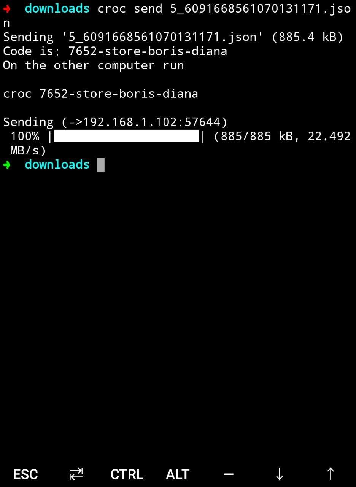

> 『开源项目』会代码与原理级地深入分析一个值得学习的开源项目。

这次要看的开源项目是 Zack Scholl 的  [croc](https://github.com/schollz/croc)，croc 用 Golang 写成，支持在**任意**两台电脑之间传输文件，对于习惯 command line 的童鞋非常友好。

## 原理

要了解 croc 的原理首先最好还是看看[作者自己怎么说](https://schollz.com/blog/croc6/)，原文写的还是非常清楚的，文件传输需要 fast, secure and easy (后面简称 FSE)，作者之前用的产品总是三取二，如何才能三者兼备呢？作者于是自己写了 croc。

想想自己日常生活中传文件也确实挺头痛的，不少人用微信传文件，然而微信的体验简直离谱，not fast, not secure and not easy；后来换成了 Telegram，确实还不错，2G 的限制基本上不会碰到，就算碰到了可以 `split` 文件挨个传输，然而这样需要上传下载走两份流量（开着代理两份流量还是有点小贵）；用一些传输服务比如 warmhole 奶牛快传基本也是 Telegram 一样的问题，两份流量，上传下载麻烦。Croc 可谓是另一种解决方案，它支持全双工，利用中继服务器实现文件实时传输，同时全程加密，cli 用起来也非常简单，实现了作者想要的 FSE。当然使用场景与上面的略有些不同，因为是实时传输所以要求两台机器时刻保持连接，如果是稍后下载这种需求我平时还是会使用 Telegram，但是想要立刻传东西，croc 实在是非常衬手。比如在安卓上可以装上 `termux`，用 `pkg install croc`，然后轻松在电脑和手机间传输文件。




## 代码解读

Croc 的代码并不算多，tokei 显示的 Golang 代码在 4k 行左右。

```
===============================================================================
 Language            Files        Lines         Code     Comments       Blanks
===============================================================================
 Dockerfile              1           16           15            0            1
 Go                     18         4574         3950          229          395
 Makefile                1           17           14            1            2
 Markdown                1          240            0          155           85
 Shell                   3           64           40           11           13
 Plain Text              1          761            0          689           72
===============================================================================
 Total                  25         5672         4019         1085          568
===============================================================================
```

`src` 目录结构也非常清楚，基本是单目录单文件，每个文件体量也比较小，代码质量也 TODO:

```
.
├── cli
│   └── cli.go
├── comm
│   ├── comm.go
│   └── comm_test.go
├── compress
│   ├── compress.go
│   └── compress_test.go
├── croc
│   ├── croc.go
│   └── croc_test.go
├── crypt
│   ├── crypt.go
│   └── crypt_test.go
├── install
│   ├── bash_autocomplete
│   ├── customization.gif
│   ├── default.txt
│   ├── Makefile
│   ├── prepare-sources-tarball.sh
│   ├── updateversion.go
│   ├── upload-src-tarball.sh
│   └── zsh_autocomplete
├── message
│   ├── message.go
│   └── message_test.go
├── models
│   └── constants.go
├── tcp
│   ├── tcp.go
│   └── tcp_test.go
└── utils
    ├── utils.go
    └── utils_test.go
10 directories, 24 files
```

下面来进行更细致地代码讲解。

###
